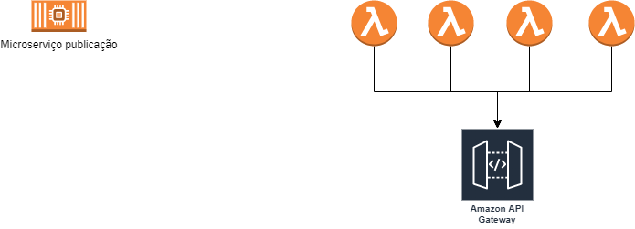

# Introdução do MVP

Com a crescente demanda no mercado nacional de pets, montamos uma iniciativa para explorar as necessidades inerentes a esse mercado. Desta forma, a **PetCare** foi criada para ser uma aplicação multiplataforma de gerenciamento de serviços relacionados ao mundo Pet. Alguns exemplos de serviços abordados:
> 1) Hospedagem de pets;
> 2) Cuidados relacionados ao bem estar do pet;
> 3) Serviço de adoção;

## Arquitetura geral da aplicação

O serviço será sustentado pela plataforma de cloud da AWS, seguindo os padrões de microsserviços. O desenho arquitetural dos componentes se apresenta da seguinte maneira:

<br><br>
<p align="center">
  
</p> 
   

***
### Definição do domínio do microsserviço `publicação`

O microsserviço de publicação deverá ser responsável por persistir uma nova publicação no DynamoDB. Em sua porta de entrada ele deverá escutar mensagens do SQS e como lógica de negócio deverá identificar quais são os usuários relevantes para visualizar a publicação, e consequentemente deverá replicar a publicação para o cache (DynamoDB) de cada usuário do sistema. Após realizar a persistência, por meio de sua porta de saída, deverá notificar cada usuário relevante de três formas:
1) Envio de e-mail;
2) Envio de mensagem via socket já aberto pelo cliente;
3) Envio de notificação push (requisição Firebase);
   
#### Entidade publicação

A entidade publicação descreve alguns subtipos de publicação:
1) Publicação de doação;
2) Publicação de hospedagem;
3) Publicação de serviço;
4) Publicação solicitação de um serviço;
   
Em sua definição mais abstrata a publicação deverá contemplar os seguintes atributos:
* Data e hora de publicação;
* Tipo da publicação;
* Código de identificação do proprietário da publicação;
* Url da imagem associada à publicação;
* Texto da publicação;
* Título da publicação;
* Código de identificação da publicação 

### Conectores de Entrada

O microsserviço de publicação deverá fazer pooling na SQS `https://sqs.sa-east-1.amazonaws.com/*******/petcare-order-post.fifo`

### Conectores de saída

O serviço enviará uma notificação.

### Estrutura do microsserviço `publicação`

O microsserviço de publicação foi construído seguindo o padrão de arquitetura hexagonal.

>```
>project
>│   README.md    
>│
>└───App
>    |    package.json
>    │   
>    └───src  
>       |   Index.ts
>       |
>       └───adapters
>       |    └───driven
>       |    |     |   MockRepository.ts
>       |    |     |   Repository.ts
>       |    |     |    
>       |    |     └───ports
>       |    |           IRepository.ts 
>       |    └───drivers
>       |          Sqs.ts
>       |    
>       └───application
>       │     └───domain
>       |     |     Assessment.ts
>       |     |     Location.ts
>       |     |     Publication.ts
>       |     |     User.ts
>       │     └───port
>       │     |    IPublishService.ts
>       │     └───services
>       |           PublicationService.ts 
>       │
>       └───test/use_cases
>              LocationTest.spec.ts
>              PublicationServiceTest.spec.ts
>              PublicationsTest.spec.ts
>              UserTest.spec.ts
>```

# Executar testes unitários

Para executar os casos de teste do microsserviço você deverá executar o comando abaixo:
>npm run test

Para executar o teste será necessário que o ambiente de execução contenha o Node.js instalado. Para visualização gráfica dos casos de teste será necessário configuração da extensão Jasmine no VS Code. Para detalhes da instalação acesse: https://marketplace.visualstudio.com/items?itemName=hbenl.vscode-jasmine-test-adapter


## Executar o programa apontando para infra AWS

Para executar o programa apontando para infra AWS você deverá executar o comando:
>npm run start
